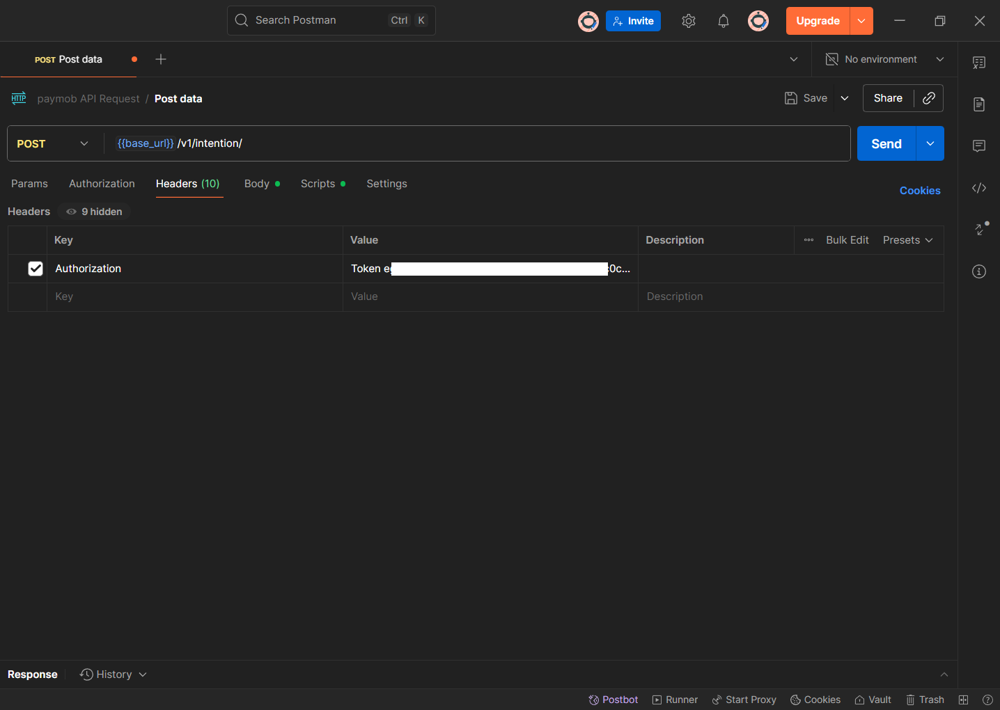
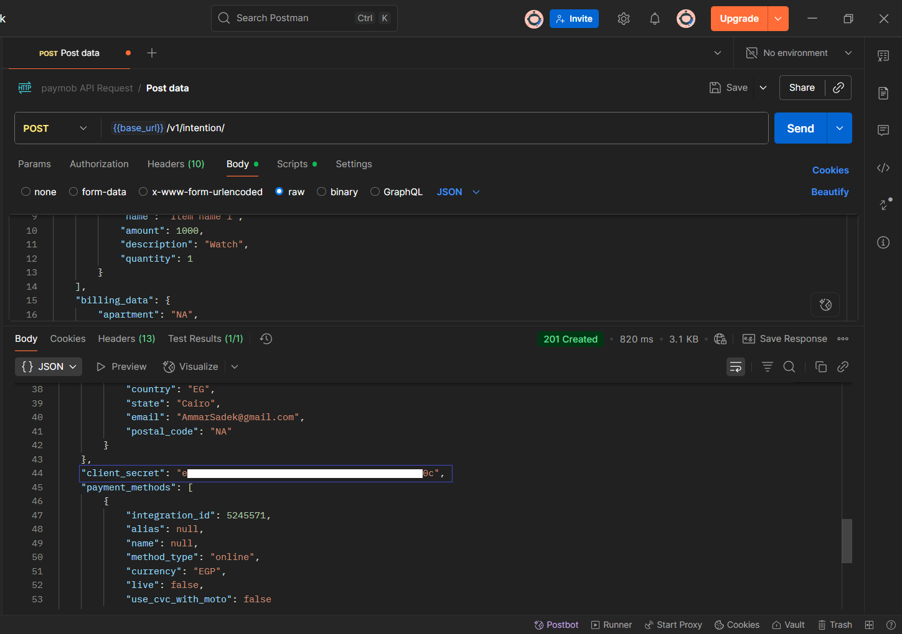

# Paymob Unified Checkout (Intention API)

## 📌 Python Integration Project

A Python project that demonstrates how to integrate with **Paymob’s Intention API** to create a payment intention and redirect the user to the **Unified Checkout Page**.

---

### 🔹 1. API Information

- **Endpoint**: [`https://accept.paymob.com/v1/intention/`](https://accept.paymob.com/v1/intention/)
- **Method**: `POST`
- **Authentication**: `Authorization: Token <SECRET_KEY>`
- **Required Parameters**:
  - `amount` → amount in **cents** (10 EGP → `1000`)
  - `currency` → `"EGP"`
  - `payment_methods` → list of **Integration IDs** from Paymob Dashboard
  - `billing_data` → customer details
- **Response**: returns a `client_secret` which is used with your **Public Key** to open the Unified Checkout page.

---

#### Postman Example

  


---

### 🔹 2. Payment Gateway (Paymob – Test Mode)

- **Create Intention** → send request with amount, billing data, integration ID
- **Client Secret** → returned in response
- **Unified Checkout URL**
``` https://accept.paymob.com/unifiedcheckout/?publicKey=<YOUR_PUBLIC_KEY>&clientSecret=<CLIENT_SECRET>
```
- **Test Cards** (Sandbox):

```
  card: 2223 0000 0000 0007
  Expiry: 01/39
  CVV: 100
```

---

### 🔹 3. Project Features

- **Environment Variables** – secure storage of keys via `.env`
- **Create Intention** – sends request to Paymob API with order data
- **Extract Client Secret** – parse JSON response to retrieve `client_secret`
- **Build Checkout URL** – combine `publicKey` and `clientSecret`
- **Webhook Support** – Paymob sends payment status to your `notification_url`
- **Redirection URL** – user redirected to a success page after payment

---

### 🔹 4. Technical Details

- **Language**: Python 3.9+
- **Libraries**:

  - [requests](https://pypi.org/project/requests/) – HTTP requests
  - [python-dotenv](https://pypi.org/project/python-dotenv/) – environment variables
  - [webbrowser](https://docs.python.org/3/library/webbrowser.html) – auto open checkout page

- **Files**:
  - `paymob_checkout.py` – main script
  - `.env` – holds Paymob credentials (**not committed**)
  - `.env.example` – example env file for setup

---

### 🔹 5. Project Flow

1. **Create Intention**  
   Python script sends a POST request to Paymob’s Intention API.

2. **Get Client Secret**  
   Extract `client_secret` from the JSON response.

3. **Generate Checkout URL**  
   Combine with `publicKey` 
``` https://accept.paymob.com/unifiedcheckout/?publicKey=<YOUR_PUBLIC_KEY>&clientSecret=<CLIENT_SECRET>
```

4. **Open in Browser**  
   Script automatically launches the checkout page.

5. **Webhook + Redirection**

- After payment:
  - Paymob notifies your `notification_url` (webhook).
  - User is redirected to `redirection_url`.

---

### 🚀 How to Set Up and Run

1. Clone the repo:

```
git clone https://github.com/Hisham-0/paymob-unified-checkout-python.git
```

2. Install dependencies:

```
pip install requests python-dotenv
```

3. Copy .env.example → .env and fill with your Paymob credentials.

4. Run the script:

```
python paymob_checkout.py
```

---

## 🎥 Demo Video (Python Script)

https://github.com/user-attachments/assets/758943f0-ff47-45b0-aa38-047a9a77878f

---
